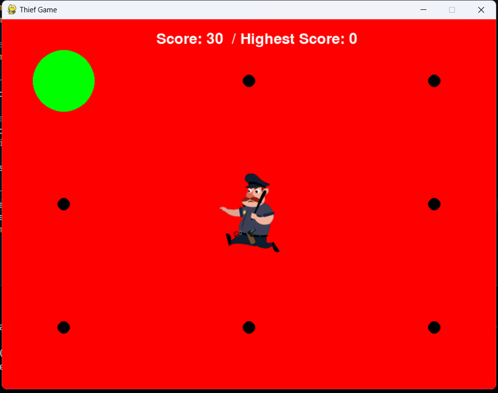

# Get Away from the Thief

## Description

"Get Away from the Thief" is an exciting and addictive game where you play as a character trying to escape from a Police. Your goal is to navigate through a maze-like environment, collect power-ups, and avoid obstacles while the police relentlessly chases you. The game offers an immersive experience with challenging levels and increasing difficulty.

## Features

- Intuitive controls: Use the arrow keys to move your character.
- Randomized maze: -
- Power-ups: -
- Obstacles: -
- Increasing difficulty: As you progress, the police becomes faster and more determined to catch you.
- High scores: Compete with friends and try to achieve the highest score on the leaderboard.

## Installation

1. Clone the repository:
2. Open the project directory:
3. Run main.py:
4. Play the game.

Note: Make sure you have Python 3 installed on your machine.

## Controls

- Use the arrow keys (Up, Down, Left, Right) keys to move the character.
- Press the 'Esc' key to pause the game.

## Dependencies

The game has the following dependencies:

- Pygame

You can install the required dependencies using pip:

## Contributing

Contributions are welcome! If you have any suggestions, bug reports, or feature requests, please open an issue or submit a pull request.

## Contact

If you have any questions or inquiries, please contact [ratnakarg@iitbhilai.ac.in](mailto:your-email@example.com).

Enjoy the game!

